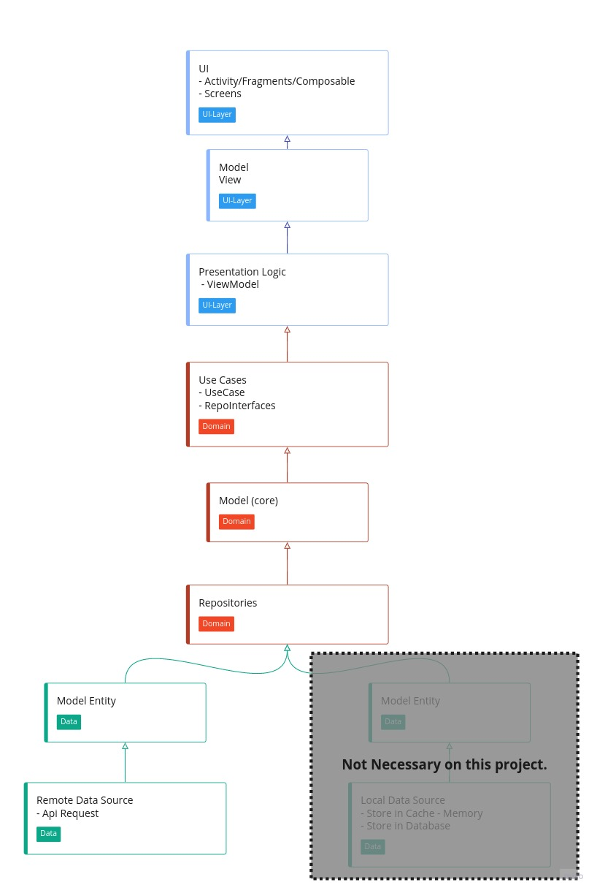

# Jokes App

  This project is a project to sort a random chuck-norris joke from  https://api.chucknorris.io

## Result

  

</p
  
## Stack

- [Jetpack](https://developer.android.com/jetpack)
    - Compose - To Create UI programmatically with composable functions.
    - Hilt - Is a dependency injection library for Android that reduces the boilerplate. 
    - ViewModel - To make a bridge between View and UseCases.
    - App Startup - initialize things (timber on this project) at app startup.
- [Clean Architecture](https://blog.cleancoder.com/uncle-bob/2012/08/13/the-clean-architecture.html)
- MVVM pattern
- Repository pattern
- Coroutines + Flows
- [Accompanist](https://google.github.io/accompanist)
- [Retrofit2](https://github.com/square/retrofit)
- [Timber](https://github.com/JakeWharton/timber)
- [mockito](https://github.com/mockito/mockito)
- GitHub Actions - CI
